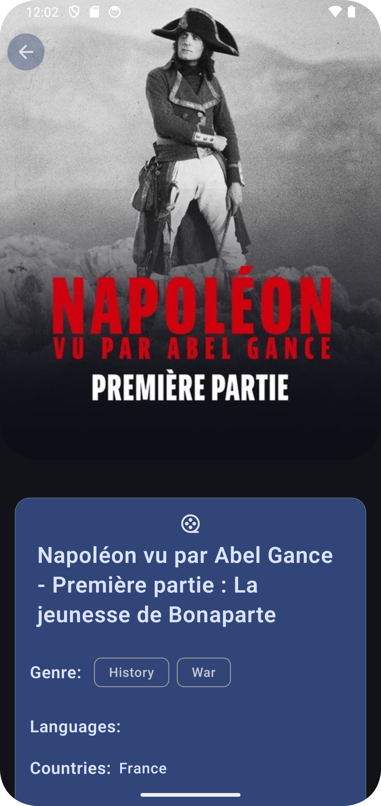

# MovieDemo

## About

MovieDemo is an Android application built with Jetpack Compose that allows users to browse and discover movies from The Movie Database (TMDb) API. It showcases modern Android development practices, focusing on a clean architecture, testability, and a delightful user experience.

## Features

- **Movie Discovery:** Browse trending and popular movies with ease.
- **Detailed Information:** View comprehensive details for each movie, including cast, crew, reviews, and trailers.

## Technologies

This project leverages a variety of cutting-edge technologies and libraries, including:

- **Jetpack Compose:** A modern toolkit for building native Android UIs with a declarative approach.
- **Kotlin Coroutines:** Simplifies asynchronous programming, enabling efficient handling of background tasks like network requests.
- **Kotlin Flow:** Provides reactive streams for observing data changes and seamlessly updating the UI.
- **Hilt:** A dependency injection library for Android that promotes testability and modularity.
- **Retrofit:** A type-safe HTTP client for Android and Java that simplifies interactions with REST APIs.
- **Coil:** An image loading library that efficiently loads and displays images in the UI.
- **Timber:** A logging library that simplifies debugging and tracking application behavior.
- **Data Paginator:** Handles pagination efficiently to display large datasets incrementally.

## Architecture

Movie Demo follows an **MVVM (Model-View-ViewModel)** architecture pattern, promoting a clear separation of concerns and making the codebase maintainable and testable.

**Here's a breakdown of the architecture layers:**

1. **UI/Presentation Layer (Jetpack Compose):**
   - **Composable Functions:** Responsible for defining the UI elements and their behavior.
   - **ViewModels:** Expose data and state to the UI and handle user interactions.

2. **Data Layer:**
   - **Repository:** Acts as a single source of truth for movie data, abstracting access to remote data sources.
   - **Data Sources:**
      - **Remote Data Source (TMDB API):** Fetches movie data from the TMDb API using Retrofit.

3. **Domain Layer:**
   - **Data Management:** The application manages data flow effectively through a combination of ViewModels and repositories. These layers work together to fetch, cache, and display data to the user while ensuring consistency and testability.
   - **State Handling:** Loading, success, and error states are seamlessly handled to provide a smooth user experience.

## Components

- **MovieListViewModel:** Manages the state and logic for displaying a list of movies, including pagination and handling loading and error states.
- **MovieDetailViewModel:** Fetches and displays detailed information about a specific movie.
- **TMDBRepository:** Provides access to movie data from both the TMDb API and the local database.
- **TMDBApi:** Defines the API endpoints for interacting with the TMDb API using Retrofit.
- **MovieDatabase:** Defines the Room database schema for storing movie data locally.

## Screenshots

Here are some screenshots of the application:

### **Home Screen**

### **Movie Details Screen**

## Getting Started

1. Clone the repository.
2. Open the project in Android Studio.
3. Build and run the app on an emulator or a physical device.

## Testing

The project includes a comprehensive suite of unit and UI tests:

- **Unit Tests:** Verify the logic of individual components in isolation.
- **UI Tests:** Simulate user interactions and assert the behavior of the UI.
- **End to End Tests:** Simulate the app in motion following some functionality.

## Future Enhancements

To enhance the functionality, user experience, and accessibility of the MovieDemo application, here are proposed improvements:

### **1. Add Animations**
Introduce subtle and engaging animations to elevate the overall user experience:
- **Screen Transitions:** Add smooth animations when navigating between screens (e.g., fade-ins, slide transitions).
- **Interactive Feedback:** Provide animated feedback for user actions, such as button presses or loading spinners.
- **Card Animations:** Animate movie cards when users scroll or tap on them to provide a modern, interactive feel.
- **Loading Indicators:** Use animated progress bars or placeholders while loading images or data.

These animations can improve user engagement, making the app more dynamic and enjoyable.

### **2. Increase User Experience**
Enhance the app’s usability and engagement through the following features:
- **Personalized Recommendations:** Suggest movies based on the user's browsing history or preferences.
- **Favorites Feature:** Allow users to mark movies as favorites for easy access later.
- **Search Functionality:** Add a search bar for users to quickly find movies by title or keywords.
- **Infinite Scrolling:** Replace paginated loading with smooth infinite scrolling for a seamless browsing experience.
- **Trailers and Previews:** Integrate video trailers and previews for movies.

By focusing on these improvements, the app can cater to a wider audience and provide a more satisfying user experience.

### **3. Improve Accessibility for Disabled Users**
Make the app more inclusive by addressing the needs of disabled users:
- **Screen Reader Support:** Ensure compatibility with screen readers to aid visually impaired users.
- **Dynamic Font Scaling:** Implement scalable fonts to accommodate users with vision impairments.
- **High-Contrast Themes:** Add high-contrast color schemes to improve visibility.
- **Voice Controls:** Explore voice command functionality for easier navigation.
- **Semantic Descriptions:** Use descriptive labels and accessibility tags for all UI components (e.g., movie posters, buttons).

These features can make MovieDemo accessible to a broader audience, ensuring no user feels excluded.

### **4. Localization**
Expand the app’s reach by supporting multiple languages:
- **Language Translations:** Add localized string resources for global users (e.g., Spanish, French, Chinese).
- **RTL (Right-to-Left) Support:** Ensure proper layout for languages like Arabic or Hebrew.
- **Region-Specific Content:** Customize content (e.g., movie recommendations or trailers) based on the user’s location.

Localization not only improves usability for non-English speakers but also helps the app gain a foothold in international markets.

### **5. Introduce Offline/Local Caching**
Enable offline functionality to improve performance and usability in poor network conditions:
- **Local Data Storage:** Use a local database (e.g., Room) to cache movie data, allowing users to browse previously viewed content offline.
- **Sync Mechanism:** Implement background synchronization to update cached data when the network becomes available.
- **Prefetching:** Load and cache data for movies the user is likely to view next, reducing wait times.
- **Offline Error Handling:** Provide user-friendly messages and options (e.g., retry) when the app detects a lack of connectivity.

Offline caching not only improves reliability but also ensures the app is functional in areas with limited or no internet access.

